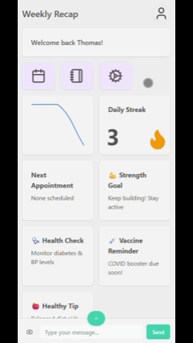

# Challenges

- https://hackathon.medical-valley-emn.de/health-chat-make-data-exploration-fun-useful-for-anyone/
- https://hackathon.medical-valley-emn.de/smart-authentification/
- https://hackathon.medical-valley-emn.de/camera-based-driver-health-assessment/
- https://hackathon.medical-valley-emn.de/drive-healthy-innovating-in-vehicle-health-monitoring-for-safer-smarter-journeys/

## Challenge 1

- https://www.medical-valley-emn.de/en/behind-the-scenes-interview-with-dr-christoph-russ-of-aws-about-challenge-1/

## Motivation

- Health is the foundation of everything we do, yet most of us only start caring when something goes wrong. Scattered medical records, forgotten symptoms, and a lack of daily awareness mean we often react to health issues rather than prevent them. What if we could change that?

## What we archived

- Onboarding & Initial Health Snapshot
- Daily Personalized Check-in with AI generated questions
- Natural Language Chat
- AI-Powered Insights & Actions
- AI-Powered diat plan
- Adaptive Health Profile

## Where we could improve

- Mobile App
- Wearable Integration
- Continues datapulling
- Export/Access to Doctor

## Environment Setup

Copy `backend/example.env` to `backend/.env` and fill in your values:

- AWS_ACCESS_KEY_ID: Your AWS access key
- AWS_SECRET_ACCESS_KEY: Your AWS secret key
- AWS_DEFAULT_REGION: AWS region (default: us-west-2)
- AWS_SESSION_TOKEN: Optional session token for temporary creds

